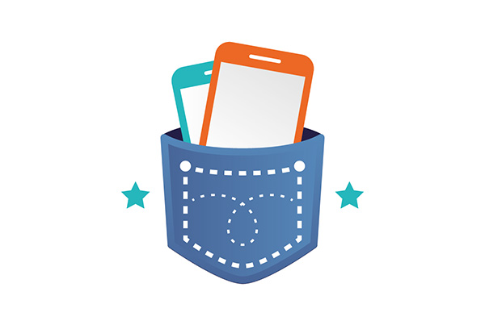

# TestPocketResult


Built with my hand :D

All fully responsive. All compatible with different browsers.

---

# Demo:

**Main demo**: ? NOT_FOUND ?

# Live Preview

[
[
[

# Version:

- v1

# Quick start

- Clone following repo:

```javascript
git clone https://github.com/nbeny/TestPocketResult .
```

Open 2 terminals.

# Client side

- Run `cd client` - go to client entry folder.
- Run `npm i` - install dependencies.
- Run `npm run start` - runs the app react.

# Server side

- Run `cd server` - go to server entry folder.
- Run `npm i` - install dependencies.
- Run `npm run test` - start the server with node.
- Run `npm run lint` - start the server with nodemon.
- Run `npm run start` - test mocha on api routes. the test are in the folder tests.
- run `npm run dev` - test javascript linter on server side.

Now you can navigate to my documentation (https://nbeny.github.io/TestPocketResult/), pick any component and place within your project.

# PRO version:

**None**:

## Documentation:

**Nicolas, detailed documentation available online on**: https://nbeny.github.io/TestPocketResult/

# Social Media:

Facebook: =(

LinkedIn: =D

## Contact:

nbeny@student.42.fr
